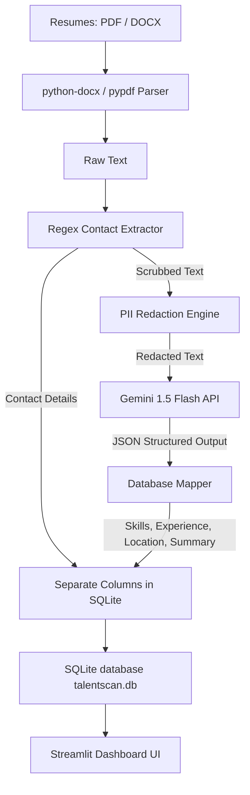

# TalentScan: Developer Interview Guide & Project Documentation

This guide is designed to help you confidently explain the architecture, design choices, privacy mechanisms, and codebase of **TalentScan** during interviews.

---

## 1. System Architecture

TalentScan uses a modern, lightweight, single-instance architecture tailored for high reliability, zero-configuration local usage, and secure cloud deployment.

### Components:
1. **Frontend / Presentation Layer (`app.py`)**: Built with **Streamlit** to create a premium, interactive recruitment dashboard. Includes dashboard metrics, search/filters, upload queues with logs, and candidate detail cards.
2. **Parsing Engine (`parser.py`)**: Handles document formats (`PDF` via `pypdf`, `DOCX` via `python-docx`).
3. **Privacy Engine (`parser.py` / `scrub_pii`)**: Runs regex & heuristic pattern matchers to extract contact data locally and scrubs all candidate name, email, and phone instances before API calls.
4. **AI Layer (`gemini_client.py`)**: Utilizes **Gemini 1.5 Flash** for parsing details, normalization, experience estimations, and candidate summaries.
5. **Persistence Layer (`database.py`)**: Powered by **SQLite** (`talentscan.db`). No heavy external database configuration needed.

---

## 2. Why Google Gemini Was Chosen

* **Structured Outputs & Schema Matching**: Gemini natively supports `response_mime_type="application/json"` and strict schema conformance, guaranteeing that the outputs returned by the model map perfectly to SQLite attributes without custom text regex parsing.
* **Large Context Window & Speed**: Gemini 1.5 Flash is highly optimized for speed and cost-effectiveness, processing entire resumes instantly.
* **Multimodal Capability**: In the future, the same API can be extended to analyze scanned image resumes or portfolio screenshots.
* **Cost Efficiency**: Flash model pricing makes it highly suitable for bulk processing compared to competitor models.

---

## 3. How PII (Personally Identifiable Information) is Protected

To comply with global data protection regulations (e.g., GDPR, CCPA) and prevent vendor lock-in or leakage of candidate details to third-party AI models:
1. **Pre-AI Extraction**: Emails and phone numbers are extracted locally using precise regular expressions. Names are extracted using case-patterns and heuristics on the first lines.
2. **Anonymization/Redaction**: Before calling the Gemini API, the `scrub_pii` function replaces all occurrences of the extracted name, email, and phone number with placeholders (`[REDACTED_NAME]`, `[REDACTED_EMAIL]`, `[REDACTED_PHONE]`).
3. **Component Splitting**: The name, email, and phone number are stored directly in SQLite without ever leaving the local computer. The Gemini API only analyzes skills, experience level, and professional history, keeping candidate identities completely safe.

---

## 4. Database Schema (SQLite)

We use two primary tables in `talentscan.db`:

### `candidates` Table:
* `id` (INTEGER PRIMARY KEY AUTOINCREMENT)
* `name` (TEXT) - Extracted locally.
* `email` (TEXT) - Extracted locally.
* `phone` (TEXT) - Extracted locally.
* `location` (TEXT) - Extracted and normalized by Gemini.
* `years_of_experience` (REAL) - Estimated by Gemini.
* `summary` (TEXT) - Generated by Gemini.
* `skills` (TEXT) - Stored as a JSON string of standardized skills.
* `original_filename` (TEXT)
* `created_at` (TIMESTAMP)

### `processing_logs` Table:
* `id` (INTEGER PRIMARY KEY AUTOINCREMENT)
* `filename` (TEXT)
* `status` (TEXT: 'SUCCESS' or 'ERROR')
* `message` (TEXT)
* `timestamp` (TIMESTAMP)

---

## 5. Search Implementation

Search filters combine SQL queries and in-memory evaluation for maximum speed and case insensitivity:
* **Name, Location, Experience**: Handled by SQL queries with parameter binding using the `LIKE` operator (e.g., `name LIKE ?`) which is case-insensitive for ASCII text, protecting against SQL injection.
* **Skill Filtering**: Since skills are stored as a JSON array (`["Python", "React"]`), filtering performs an in-memory sub-string check on parsed lists to guarantee clean, structured matching across all case formats.

---

## 6. Common Interview Q&As

### Q1: How does the application handle multiple file uploads at the same time?
> **Answer**: Streamlit's `file_uploader` is configured with `accept_multiple_files=True`. During file processing, we loop through the file list, update the progress bar incrementally, and show real-time parsing logs in a console-like window.

### Q2: Why use SQLite instead of a production database like PostgreSQL?
> **Answer**: SQLite runs entirely in-memory or as a local file, meaning the application is runnable immediately with zero-configuration (`pip install -r requirements.txt` followed by `streamlit run app.py`). In a production setting, the SQLite connection string in `database.py` can be replaced with a PostgreSQL engine via SQLAlchemy with minimal line modifications.

### Q3: What happens if a resume is corrupt or has invalid formatting?
> **Answer**: We wrap each file processing task in a `try-except` block. If a file fails to parse, the error message is recorded in the `processing_logs` table, a warning log is shown in the terminal console in real-time, a toast notification alerts the recruiter, and the system continues processing the remaining resumes in the queue.

### Q4: How is Skill Normalization implemented?
> **Answer**: Gemini is explicitly instructed in the system prompt to normalize skill names (e.g., merging variations of "React.js", "ReactJS", and "React" into a single standardized keyword "React"). Post-processing in Python also de-duplicates skills case-insensitively to keep dashboard charts clean.
